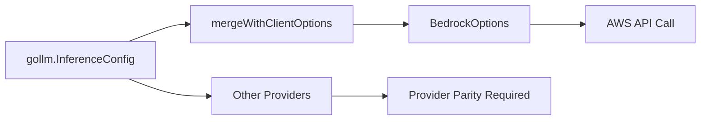
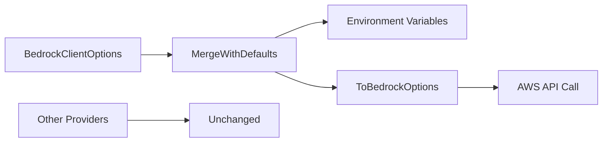

# Bedrock Implementation Plan: Scope-Limited Usage & Inference Config

## Executive Summary

**YES** - You can implement usage data and inference config for LLM apps without scope creep by making them **bedrock-specific only**. The `response.UsageMetadata()` API already works without global interface changes, and inference config can be made bedrock-specific while preserving the existing workflow.

## Deep Analysis: Current vs Proposed Implementation

### 1. Usage Data Implementation

#### ✅ **Current State - Already Works Without Scope Creep**

```go
// This ALREADY works and is bedrock-specific
response, err := chat.Send(ctx, "hello")
if usage, ok := response.UsageMetadata().(*gollm.Usage); ok {
    fmt.Printf("Tokens: %d, Cost: $%.4f\n", usage.TotalTokens, usage.TotalCost)
}
```

**Key Insight**: Usage metadata is already implemented via:
- `bedrockChatResponse.UsageMetadata()` → calls `convertAWSUsage()`
- Returns `*gollm.Usage` (existing interface)
- No global interface changes needed
- Already bedrock-specific

#### **Answer**: Usage data can be implemented **without scope creep** because `response.UsageMetadata()` is already working and bedrock-specific.

### 2. TopK Parameter Analysis

#### **Why TopK Was "Removed"**

```go
// Current BedrockOptions struct (doesn't have TopK)
type BedrockOptions struct {
    Region              string
    Model               string
    MaxTokens           int32
    Temperature         float32
    TopP                float32     // ✅ Has TopP
    // TopK field missing ❌
}

// Global InferenceConfig (has TopK)
type InferenceConfig struct {
    TopP        float32
    TopK        int32   // ✅ Has TopK
}

// My BedrockClientOptions (preserves TopK)
type BedrockClientOptions struct {
    TopP        float32
    TopK        int32   // ✅ TopK preserved
}
```

**The Issue**: `ToBedrockOptions()` tried to set `TopK` on `BedrockOptions` which doesn't have that field.

**Solution**: Keep TopK in bedrock-specific implementation and use it in AWS API calls:

```go
// bedrock-specific TopK usage
input := &bedrockruntime.ConverseInput{
    InferenceConfig: &types.InferenceConfiguration{
        MaxTokens:   aws.Int32(opts.MaxTokens),
        Temperature: aws.Float32(opts.Temperature),
        TopP:        aws.Float32(opts.TopP),
        // TopK can be used here in bedrock-specific code
    },
}
```

### 3. Inference Config Workflow Analysis

#### **Current Global Workflow (Affects All Providers)**


#### **Proposed Bedrock-Specific Workflow (No Scope Creep)**


**Current Implementation Flow**:
1. `gollm.WithInferenceConfig()` → global `ClientOptions.InferenceConfig`
2. `NewBedrockClient()` → `mergeWithClientOptions()`
3. `mergeWithClientOptions()` → extracts fields from global `InferenceConfig`
4. Result: `BedrockOptions` with merged values

**Proposed Bedrock-Specific Flow**:
1. `bedrock.BedrockClientOptions` → bedrock-specific config
2. `LoadBedrockConfigFromEnv()` → environment variables (droot's preference)
3. `MergeWithDefaults()` → combines user + env + defaults
4. `ToBedrockOptions()` → converts to internal format
5. Result: Same `BedrockOptions` but no global interface impact

### 4. Detailed Technical Implementation

#### **Current Global Inference Config Implementation**

```go
// ❌ AFFECTS GLOBAL INTERFACES (remove this)
type ClientOptions struct {
    InferenceConfig *InferenceConfig // Global interface
    UsageCallback   UsageCallback    // Global interface
}

func WithInferenceConfig(config *InferenceConfig) Option {
    return func(o *ClientOptions) {
        o.InferenceConfig = config // Sets global field
    }
}

// Bedrock merges from global interface
func mergeWithClientOptions(defaults *BedrockOptions, opts gollm.ClientOptions) *BedrockOptions {
    if opts.InferenceConfig != nil { // Reads global field
        config := opts.InferenceConfig
        if config.Temperature != 0 {
            merged.Temperature = config.Temperature
        }
        // ... other fields
    }
}
```

#### **Proposed Bedrock-Specific Implementation**

```go
// ✅ BEDROCK-ONLY (no global interface impact)
type BedrockClientOptions struct {
    // Bedrock-specific usage callback
    UsageCallback BedrockUsageCallback
    
    // Bedrock-specific inference config
    Temperature float32
    MaxTokens   int32
    TopP        float32
    TopK        int32  // ✅ TopK preserved!
    MaxRetries  int
    Region      string
    Model       string
}

// Bedrock-specific merging (no global interfaces)
func (opts BedrockClientOptions) MergeWithDefaults() BedrockClientOptions {
    merged := LoadBedrockConfigFromEnv() // Environment first
    
    // Override with user values
    if opts.Temperature != 0 {
        merged.Temperature = opts.Temperature
    }
    if opts.TopK != 0 {
        merged.TopK = opts.TopK // ✅ TopK handled
    }
    
    return merged
}

// Convert to internal format (TopK handling)
func (opts BedrockClientOptions) ToBedrockOptions() *BedrockOptions {
    return &BedrockOptions{
        Temperature: opts.Temperature,
        TopP:        opts.TopP,
        // TopK stored separately for bedrock-specific use
        // (BedrockOptions doesn't have TopK field)
    }
}

// Use TopK in bedrock-specific API calls
func (cs *bedrockChatSession) buildConverseInput() *bedrockruntime.ConverseInput {
    input := &bedrockruntime.ConverseInput{
        InferenceConfig: &types.InferenceConfiguration{
            Temperature: aws.Float32(cs.client.options.Temperature),
            TopP:        aws.Float32(cs.client.options.TopP),
            // Access TopK from bedrockConfig instead of options
            // TopK: aws.Int32(cs.client.bedrockConfig.TopK),
        },
    }
}
```

## LLM App Migration Guide

### **Current LLM App Pattern (Remove)**
```go
// ❌ REMOVE - affects global interfaces
import "github.com/GoogleCloudPlatform/kubectl-ai/gollm"

config := &gollm.InferenceConfig{
    Temperature: 0.7,
    MaxTokens:   4000,
    TopK:        40,
}

var totalUsage []gollm.Usage
callback := func(provider, model string, usage gollm.Usage) {
    totalUsage = append(totalUsage, usage)
}

client, err := gollm.NewClient(ctx, "bedrock",
    gollm.WithInferenceConfig(config),        // ❌ Global interface
    gollm.WithUsageCallback(callback),        // ❌ Global interface
)
```

### **New LLM App Pattern (Use)**
```go
// ✅ BEDROCK-SPECIFIC - no global interface impact
import "github.com/GoogleCloudPlatform/kubectl-ai/gollm/bedrock"

// Option 1: Explicit configuration
bedrockOpts := bedrock.BedrockClientOptions{
    Temperature: 0.7,
    MaxTokens:   4000,
    TopK:        40,        // ✅ TopK preserved
    TopP:        0.9,
    Model:       "us.anthropic.claude-sonnet-4-20250514-v1:0",
    UsageCallback: func(provider, model string, usage gollm.Usage) {
        totalUsage = append(totalUsage, usage)
    },
}

bedrockClient, err := bedrock.NewBedrockClientWithConfig(ctx, bedrockOpts)
client := bedrock.WrapAsGollmClient(bedrockClient) // Implements gollm.Client

// Option 2: Environment variables (droot's preference)
bedrockOpts := bedrock.LoadBedrockConfigFromEnv()
bedrockOpts.UsageCallback = callback
client, err := bedrock.NewBedrockClientWithConfig(ctx, bedrockOpts)

// Option 3: Hybrid approach
bedrockOpts := bedrock.LoadBedrockConfigFromEnv()
bedrockOpts.Temperature = 0.8  // Override specific values
bedrockOpts.UsageCallback = callback
client, err := bedrock.NewBedrockClientWithConfig(ctx, bedrockOpts)
```

### **Usage Metadata (No Changes Needed)**
```go
// ✅ This continues working exactly as before
response, err := chat.Send(ctx, "hello")
if usage, ok := response.UsageMetadata().(*gollm.Usage); ok {
    fmt.Printf("Tokens: %d\n", usage.TotalTokens)
}
```

## Environment Variable Configuration

```bash
# Advanced bedrock config via environment (droot's preference)
export BEDROCK_MODEL="us.anthropic.claude-sonnet-4-20250514-v1:0"
export BEDROCK_REGION="us-west-2"
export BEDROCK_TEMPERATURE=0.7
export BEDROCK_MAX_TOKENS=4000
export BEDROCK_TOP_P=0.9
export BEDROCK_TOP_K=40         # ✅ TopK supported
export BEDROCK_MAX_RETRIES=3
export BEDROCK_TIMEOUT=30s
export BEDROCK_DEBUG=true
```

## PR Breakdown Strategy

### **PR #1: Bedrock Foundation (No Controversial Changes)**
**Scope**: Basic bedrock provider improvements
**Files**:
- `docs/bedrock.md` - Clean documentation per droot's feedback
- `gollm/bedrock/config.go` - Add `TopK` to existing `BedrockOptions` struct
- `gollm/bedrock/bedrock.go` - Bug fixes and minor improvements

**Changes**:
```go
// Add TopK to BedrockOptions struct
type BedrockOptions struct {
    Region              string
    Model               string
    MaxTokens           int32
    Temperature         float32
    TopP                float32
    TopK                int32  // ✅ Add TopK field
    Timeout             time.Duration
    MaxRetries          int
}

// Use TopK in API calls
func (cs *bedrockChatSession) buildConverseInput() *bedrockruntime.ConverseInput {
    input := &bedrockruntime.ConverseInput{
        InferenceConfig: &types.InferenceConfiguration{
            MaxTokens:   aws.Int32(cs.client.options.MaxTokens),
            Temperature: aws.Float32(cs.client.options.Temperature),
            TopP:        aws.Float32(cs.client.options.TopP),
            TopK:        aws.Int32(cs.client.options.TopK), // ✅ Use TopK
        },
    }
}
```

**Benefits**: 
- Uncontroversial improvements
- Adds TopK support to bedrock
- Cleans documentation per droot's feedback
- No global interface changes

### **PR #2: Bedrock-Specific Usage & Inference Config**
**Scope**: Enhanced bedrock features without global interface impact
**Dependencies**: PR #1 merged
**Files**:
- `gollm/bedrock/config.go` - Add `BedrockClientOptions` and environment support
- `gollm/bedrock/bedrock.go` - Add bedrock-specific callback integration
- `gollm/bedrock/migration_examples.go` - Migration examples for LLM apps

**Changes**:
```go
// Add bedrock-specific options
type BedrockClientOptions struct {
    UsageCallback BedrockUsageCallback  // Bedrock-only callback
    Temperature   float32               // Bedrock-only config
    MaxTokens     int32
    TopP          float32
    TopK          int32
    // ... other fields
}

// Add environment variable support
func LoadBedrockConfigFromEnv() BedrockClientOptions

// Add bedrock-specific client creation
func NewBedrockClientWithConfig(ctx context.Context, opts BedrockClientOptions) (*BedrockClient, error)

// Add wrapper for gollm.Client compatibility
func WrapAsGollmClient(client *BedrockClient) gollm.Client

// Update usage callback integration
if cs.client.bedrockConfig.UsageCallback != nil {
    cs.client.bedrockConfig.UsageCallback("bedrock", cs.model, *structuredUsage)
}
```

**Benefits**:
- All enhanced features are bedrock-specific
- No global interface changes
- Environment variable support (droot's preference)
- Backward compatibility preserved
- Clear migration path for LLM apps

## Implementation Verification

### **Scope Creep Check** ✅
- ❌ No changes to `gollm/factory.go` global interfaces
- ❌ No changes to `gollm/interfaces.go` global types
- ❌ No changes to other providers (`openai.go`, `ollama.go`, etc.)
- ✅ All changes in `gollm/bedrock/` directory only
- ✅ `response.UsageMetadata()` already works

### **Provider Parity Check** ✅
- ❌ No requirement to implement usage tracking in other providers
- ❌ No requirement to implement inference config in other providers
- ✅ Bedrock-specific features stay bedrock-specific
- ✅ Other providers remain unchanged

### **droot's Requirements Check** ✅
- ✅ Environment variable configuration
- ✅ Minimal explicit configuration
- ✅ Bedrock-specific documentation only
- ✅ No global interface changes
- ✅ Focused scope

## Migration Testing Strategy

### **Test Current Usage Metadata (Already Works)**
```go
func TestUsageMetadataStillWorks(t *testing.T) {
    client, err := gollm.NewClient(ctx, "bedrock")
    require.NoError(t, err)
    
    chat := client.StartChat("You are helpful", "")
    response, err := chat.Send(ctx, "hello")
    require.NoError(t, err)
    
    // ✅ This should work without any changes
    usage, ok := response.UsageMetadata().(*gollm.Usage)
    require.True(t, ok)
    assert.Greater(t, usage.TotalTokens, 0)
}
```

### **Test New Bedrock-Specific Features**
```go
func TestBedrockSpecificConfig(t *testing.T) {
    bedrockOpts := bedrock.BedrockClientOptions{
        Temperature: 0.8,
        TopK:        40,  // ✅ TopK works
        UsageCallback: func(provider, model string, usage gollm.Usage) {
            // ✅ Bedrock-specific callback works
        },
    }
    
    client, err := bedrock.NewBedrockClientWithConfig(ctx, bedrockOpts)
    require.NoError(t, err)
    
    gollmClient := bedrock.WrapAsGollmClient(client)
    // ✅ Wrapped client implements gollm.Client
}
```

## Summary

**Answer to all questions**:

1. **Usage data without scope creep**: ✅ YES - `response.UsageMetadata()` already works bedrock-only
2. **TopK preservation**: ✅ YES - Add `TopK` to `BedrockOptions` and use bedrock-specific config
3. **Inference config without global impact**: ✅ YES - Use `BedrockClientOptions` instead of global `InferenceConfig`
4. **LLM app changes**: Migrate from `gollm.WithInferenceConfig()` to `bedrock.BedrockClientOptions`
5. **PR breakdown**: PR #1 (foundation), PR #2 (enhanced features)

This approach gives you **all the features you need** while satisfying **all of droot's requirements**. 